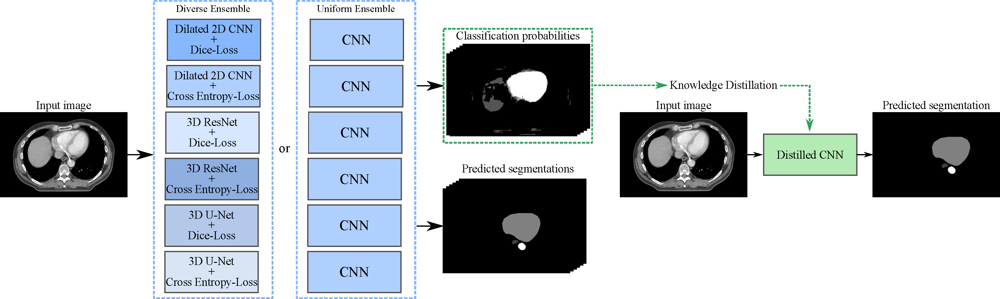

# Ensemble knowledge distillation

This repository contains the Python scripts to train multiple different neural network types for semantic segmentation in 3D medical images,
ensemble these models and train a student model via knowledge distillation. This student network performs in most cases equally well as the
ensemble.



## Preparations

Install the required packages (requires a Python 3 installation):

```shell
pip install -r requirements.txt
```

The original images and segmentation masks need to be pre-processed before starting the network training. This example uses the data from [the KiTS19 Challenge](https://github.com/neheller/kits19).

Resample the data:
    
```shell
python resample_data.py -d "path-to-data-directory" 
```

Split the dataset into subsets used for training, validation and testing by creating folders "train", "val", "test". Distribute the pre-processed cases over these folders as you like.

In all commands below, the directory `/path/to/data/directory/` is assumed to contain the "train", "val" and "test" directories, i.e., you should have:

    /path/to/data/directory/test
    /path/to/data/directory/train
    /path/to/data/directory/val

## Training

Start a local visdom server on port 8008 to monitor the training process:

```shell
python -m visdom.server -p 8008
```

Train a 2D network for background/kidney+tumor segmentation. We used 123 as our random seed, but you can use any other value.

```shell
python training_network.py -n dil2D  \
                           -d /path/to/data/directory/ \
                           -s /path/to/save/directory/ \
                           -x randomseed \
                           -i 100000 \
                           --receptive-field-size 131 \
                           --sample-size 54 \
                           --patch-inclusion-criteria entire-sample-area \
                           --classes 0,3
```

Train a 2D network for background/kidney/tumor segmentation:

```shell
python training_network.py -n dil2D  \
                           -d /path/to/data/directory/ \
                           -s /path/to/save/directory/ \
                           -x randomseed \
                           -i 50000 \
                           --receptive-field-size 35 \
                           --sample-size 10 \
                           --patch-inclusion-criteria patch_center_voxel \
                           --classes 0,1,2 \
                           --balance-ratios 0,5,5
```

## Testing
Testing a 2D network for background/kidney+tumor segmentation:

```shell
python testing_network.py -d /path/to/data/directory/ \
                          -s /path/to/save/directory/ \
                          -r nameofexperiment \
                          -n dil2D -e val \
                          --network-weights /path/to/network/weights/FINAL*100000.pth \
                          --receptive-field-size 131 \
                          --classes 0,3
```

Testing a 2D network for background/kidney/tumor segmentation:

```shell
python testing_network.py -d /path/to/data/directory/ \
                          -s /path/to/save/directory/ \
                          -r nameofexperiment \
                          -n dil2D -e val \
                          --network-weights /path/to/network/weights/FINAL*50000.pth \
                          --receptive-field-size 35 \
                          --classes 0,1,2
```

## Ensembling

Obtaining soft labels for a 2D network for background/kidney+tumor segmentation:

```shell
python ensemble.py -d /path/to/data/directory/ \
                      -s /path/to/save/directory/ \
                      -e val \
                      --receptive-field-size 131 \
                      --sample-size 54 \
                      --classes 0,3
```

Obtaining soft labels for a 2D network for background/kidney/tumor segmentation:

```shell
python ensemble.py -d /path/to/data/directory/ \
                   -s /path/to/save/directory/ \
                   -e val \
                   --receptive-field 35 \
                   --sample-size 10 \
                   --clip True \
                   --classes 0,1,2
```

## Knowledge Distillation

Retrain the best-performing network from the ensemble and activate knowledge distillation with the setting `--soft` to train the network with both the reference segmentations and the soft labels predicted by the ensemble.
